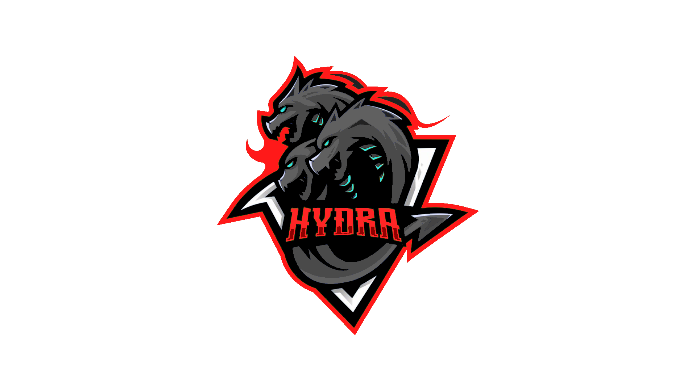

# HYDRAlib



>[IMPORTANT]
> HYDRAlib v1.0.0 is out, can't wait to se what you'll create!

## What is HYDRAlib?
HYDRAlib is a robotics programming library for Vex Robotics Competition robots, with support for V5 and Vex U robots that use PROS (Programable Robotics Operating System).

## LICENSE
This repository is under an [Gnu General Public License v3.0](https://github.com/Rohan-Bharatia/HYDRAlib/blob/main/LICENSE)

## Implementation
To download this repository open [HYDRAlib.zip](https://github.com/Rohan-Bharatia/HYDRAlib/archive/refs/tags/HYDRAlib.zip)

To create an empty template of this project, download the GitHub repository, and store all files/folders under a folder called ```HYDRAlib```, and then (outside of that folder), create a file called ```main.cpp``` and copy/paste this code if you are in the Vex V5 Robotics Competition:
```cpp
#define _V5RC
#include "HYDRAlib.h"
using namespace HYDRAlib;

void initialize()
{
    set_default_movement_constants();
}

void disabled()
{}

void competition_initialize()
{}

void autonomous()
{
    AutonSelector::run_selected_auton();
}

void opcontrol()
{
    AutonSelector::disable_auton_selector();

    while(running)
    {
        pros::delay(Utils::DELAY_TIME);
    }
}
```

If you are in the Vex U Robotics Competition, copy/paste this code:
```cpp
#define _VURC
#include "HYDRAlib.h"
using namespace HYDRAlib;

void initialize()
{
    set_default_movement_constants();
}

void disabled()
{}

void competition_initialize()
{}

void autonomous()
{
    AutonSelector::run_selected_auton();
}

void opcontrol()
{
    AutonSelector::disable_auton_selector();

    while(running)
    {
        pros::delay(Utils::DELAY_TIME);
    }
}
```

Or, if you are just testing or messing around with something, copy/paste this code:
```cpp
#define _TESTING
#include "HYDRAlib.h"
using namespace HYDRAlib;

void initialize()
{
    set_default_movement_constants();
}

void disabled()
{}

void competition_initialize()
{}

void autonomous()
{
    AutonSelector::run_selected_auton();
}

void opcontrol()
{
    AutonSelector::disable_auton_selector();

    while(running)
    {
        pros::delay(Utils::DELAY_TIME);
    }
}
```

<span color="red">**Warning**</span>: If these steps aren't followed exactly, then the code will not run properly or at all.

## Documentation
Read the ```/templates/v5``` or ```templates/vex U``` folders for information on how to use the HYDRAlib features to the best of their ability.
